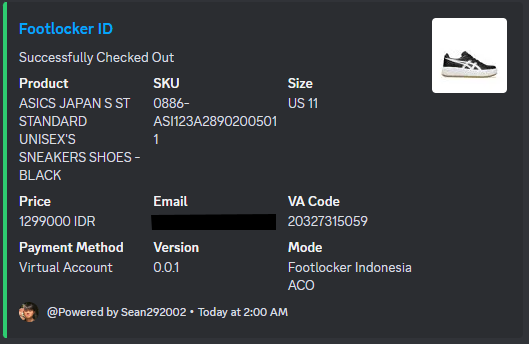

# Footlocker Indonesia Auto Checkout Script

This Python script automates the checkout process for Footlocker Indonesia, designed to help sneaker enthusiasts secure their purchases quickly and efficiently. 

## Features

- **Auto Checkout**: Automates the entire checkout process on Footlocker Indonesia.
- **Proxy Support**: Utilizes proxies for requests to avoid IP bans and rate limits, configured via 'proxies.txt'.
- **Threading**: Handles multiple checkout tasks simultaneously, configured via `ftltasks.csv`.

## Configuration
- **Webhook**: You need to add your own webhook url in the webhook function
- **ftltasks.csv**: You need to edit the csv for your account information
- **Proxies**: Add your proxy details to `proxies.txt` in the format `ip:port:user:

## Prerequisites

Before running the script, ensure you have Python installed on your system. The script has been tested with Python 3.8 and above.

## Installation

Clone the repository to your local machine:
```bash
git clone https://github.com/yourusername/footlocker-indonesia-bot.git
cd footlocker-indonesia-bot
```

## Usage

To run the script, navigate to the project directory and execute:

```bash
py footlockerbot.py
```

Ensure that `proxies.txt` and `ftltasks.csv` are correctly configured and present in the project directory.

## Error Handling and Optimization

The script includes basic error handling to manage common exceptions and errors. However, it is not fully optimized and currently provides a base structure for automation. Further optimization and more robust error-handling methods may be implemented in the future, but updates are unlikely.

## Contributing

Contributions to improve the script are welcome. Please follow these steps to contribute:

Pull requests are welcome. For major changes, please open an issue first to discuss what you would like to change.

Please make sure to update tests as appropriate.

## License

[MIT](https://choosealicense.com/licenses/mit/)



